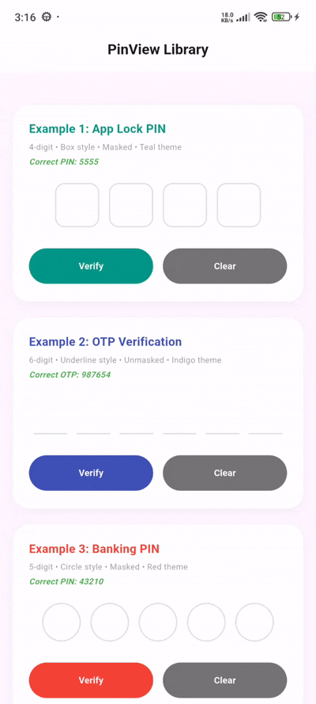

# Custom PinView Library for Flutter

[](https://flutter.dev)
[](https://opensource.org/licenses/MIT)
[](#)

**Custom PinView Library** is a powerful, production-ready Flutter library that provides a highly customizable PIN/OTP input component. Perfect for app locks, two-factor authentication, banking apps, or any secure numeric code entry screen.

---

## 📷 Preview

<p align="center">
  
</p>

*A beautiful, customizable PIN view widget with multiple styles, error animations, and standard input support.*

---

## ✨ Features

- **Three Beautiful Styles**
  - **BOX** — Classic bordered boxes with rounded corners.
  - **UNDERLINE** — Clean, modern underline style.
  - **CIRCLE** — Elegant circular indicators.
- **Customizable Dimensions & Styling**
  - Adjust cell width, height, spacing, border radius, and border thickness.
  - Set custom colors for every state: empty, focused, filled, and error.
- **Validation & Animation**
  - Built-in validation support (`validator`).
  - Automatically triggers a sleek horizontal shake animation on errors.
- **Interactive Experience**
  - Blinking cursor support for active focus cells.
  - Auto-focus, obscure text (e.g., for password input), and custom obscuring characters.
- **Dual Mode Support**
  - Functions as a premium PIN/OTP input or a standard styled text field using the same API.

---

## 📦 Installation

To use this library in your Flutter project, add it to your `pubspec.yaml` dependencies:

```yaml
dependencies:
  flutter:
    sdk: flutter
  flutter_pin_view_library:
    path: E:/Flutter_Codes/pin_library/flutter_pin_view_library
```

*Note: Use the appropriate path where your library is located.*

---

## 🚀 Usage

Import the package in your Dart code:

```dart
import 'package:flutter_pin_view_library/flutter_pin_view_library.dart';
```

### 1. Basic PIN/OTP View (Box Style)
```dart
PinView(
  isPinMode: true,
  pinLength: 4,
  onPinCompleted: (pin) {
    print("Entered PIN: $pin");
  },
)
```

### 2. Underline OTP View with Validation
```dart
PinView(
  isPinMode: true,
  pinLength: 6,
  pinStyle: PinStyle.underline,
  obscureText: false,
  validator: (value) {
    if (value == null || value.length < 6) {
      return "OTP must be 6 digits";
    }
    return null;
  },
  onPinCompleted: (otp) {
    print("OTP Code: $otp");
  },
)
```

### 3. Customized Circle Style
```dart
PinView(
  isPinMode: true,
  pinLength: 5,
  pinStyle: PinStyle.circle,
  obscureText: true,
  pinTheme: PinTheme(
    cellWidth: 60,
    cellHeight: 60,
    spacing: 15,
    filledColor: Colors.blue.withOpacity(0.1),
    focusedBorderColor: Colors.blue,
    filledBorderColor: Colors.blueAccent,
  ),
)
```

---

## 📄 License

```lic
MIT License

Copyright (c) 2026 Excelsior Technologies

Permission is hereby granted, free of charge, to any person obtaining a copy
of this software and associated documentation files (the "Software"), to deal
in the Software without restriction, including without limitation the rights
to use, copy, modify, merge, publish, distribute, sublicense, and/or sell
copies of the Software, and to permit persons to whom the Software is
furnished to do so, subject to the following conditions:

The above copyright notice and this permission notice shall be included in all
copies or substantial portions of the Software.

THE SOFTWARE IS PROVIDED "AS IS", WITHOUT WARRANTY OF ANY KIND, EXPRESS OR
IMPLIED, INCLUDING BUT NOT LIMITED TO THE WARRANTIES OF MERCHANTABILITY,
FITNESS FOR A PARTICULAR PURPOSE AND NONINFRINGEMENT. IN NO EVENT SHALL THE
AUTHORS OR COPYRIGHT HOLDERS BE LIABLE FOR ANY CLAIM, DAMAGES OR OTHER
LIABILITY, WHETHER IN AN ACTION OF CONTRACT, TORT OR OTHERWISE, ARISING FROM,
OUT OF OR IN CONNECTION WITH THE SOFTWARE OR THE USE OR OTHER DEALINGS IN THE
SOFTWARE.
```
